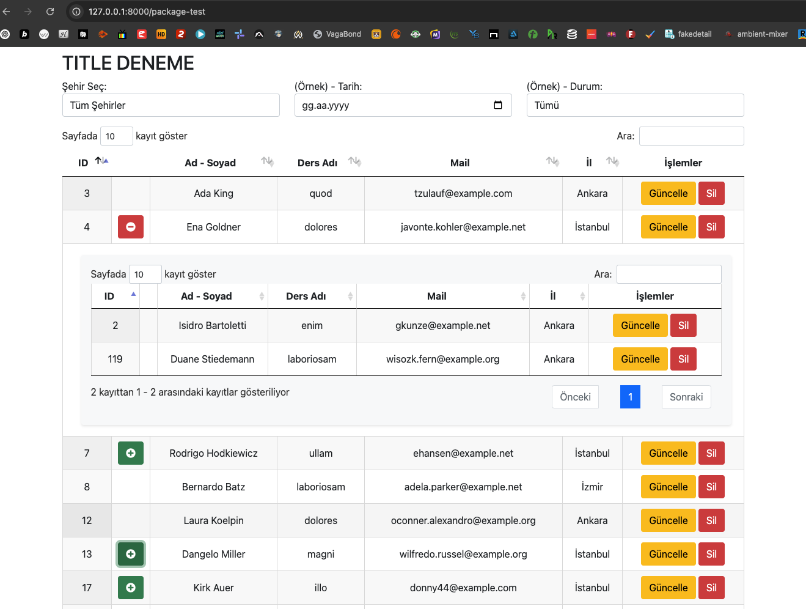

# BabaSultan23 Dynamic Datatable

Laravel projeleri için geliştirilmiş, filtreleme, arama ve iç içe satır desteği gibi gelişmiş özelliklere sahip güçlü ve esnek bir DataTable paketi.

## Özellikler

- 🚀 Laravel projelerine kolay entegrasyon
- 📊 Dinamik kolon yapılandırması
- 🔍 Gelişmiş filtreleme ve arama özellikleri
- 📱 Responsive tasarım
- 🌐 Çoklu dil desteği
- 📦 İç içe (Parent-Child) satır desteği
- 🎨 Özelleştirilebilir aksiyon butonları
- 🔄 Manuel ve otomatik arama seçenekleri
- 🎯 Özel sıralama ve arama eşleştirme

## Kurulum

```bash
composer require babasultan23/dynamic-datatable
```

## Yapılandırma

Yapılandırma dosyasını yayınlayın:

```bash
php artisan vendor:publish --provider="BabaSultan23\DynamicDatatable\DynamicDatatableServiceProvider" --tag=config
php artisan vendor:publish --provider="BabaSultan23\DynamicDatatable\DynamicDatatableServiceProvider" --tag=crudAjax

//Dil paketlerine ekleme yapmak isterseniz çalıştırınız
php artisan vendor:publish --provider="BabaSultan23\DynamicDatatable\DynamicDatatableServiceProvider" --tag=lang_path
```

## Temel Kullanım

Laravel uygulamanızda dinamik datatable'ı uygulamak için temel bir örnek:

```php
use BabaSultan23\DynamicDatatable\Facades\BabaSultan23DynamicDatatable;

public function index()
{
    $columns = [
            ['data' => 'id', 'title' => 'ID'],
            ['data' => 'name', 'title' => 'Ad Soyad'],
            ['data' => 'email', 'title' => 'E-posta'],
        ];

        $dataTable = BabaSultan23DynamicDatatable::render(
            tableId: 'my-table',
            dataTableName: 'myDatatable',
            columns: $columns,
            fetchUrl: route('package.fetch'),
            title: 'Veri Tablosu'
        );

    return view('package-test', compact('dataTable'));
}
  
public function fetch(Request $request)
{
    $query = Student::query();
    
    return BabaSultan23DynamicDatatable::processDataTableRequest($query, $request);
}

```

## Gelişmiş Özellikler

### 1. Kolon Yapılandırması

Çeşitli seçeneklerle kolonlarınızı tanımlayın:

```php
$columns = [
    ['data' => 'id', 'title' => 'ID'],
    ['data' => 'plus', 'title' => '', 'orderable' => 'false'],
    ['data' => 'full_name', 'title' => 'Ad Soyad'],
    ['data' => 'email', 'title' => 'E-posta'],
    ['data' => 'city', 'title' => 'Şehir'],
    ['data' => 'actions', 'title' => 'İşlemler', 'orderable' => 'false']
];
```

### 2. Özel Filtreler

DataTable'ınıza özel filtreler ekleyin:

```php
$filters = [
    'html' => '
        <div class="row mb-3">
            <div class="col-md-4">
                <label for="cityFilter">Şehir Seçin:</label>
                <select id="cityFilter" class="form-control">
                    <option value="">Tüm Şehirler</option>
                </select>
            </div>
        </div>
    ',
    'js' => [
        'filterElements' => ['cityFilter'],
        'filterData' => "
            d.city = $('#cityFilter').val();
        "
    ]
];
```

### 3. İç İçe Satırlar

Parent-child ilişkili satırları etkinleştirin:

```php
BabaSultan23DynamicDatatable::render(
    // ... diğer seçenekler ...
    plusButton: true,
    plusParentIdKey: 'parent_id'
);
```

### 4. Özel Aksiyon Butonları

Her satır için özel aksiyon butonları tanımlayın:

```php
BabaSultan23DynamicDatatable::setActionButtons(function ($row) {
    return '<button onclick="kayitGuncelle(' . $row->id . ')" class="btn btn-warning">Güncelle</button>
            <button onclick="kayitSil(' . $row->id . ')" class="btn btn-danger">Sil</button>';
});
```

### 5. Özel Arama ve Sıralama Eşleştirme

Özel arama ve sıralama eşleştirmelerini yapılandırın:

```php
BabaSultan23DynamicDatatable::setOrderMapping([
    'full_name' => "CONCAT(users.first_name, ' ', users.last_name)",
    'department_name' => 'departments.name',
])
->setSearchMapping([
    'full_name' => "CONCAT(users.first_name, ' ', users.last_name)",
    'email' => 'users.email',
    'city' => 'users.city'
]);
```

### 6. Manuel Arama Uygulaması

Manuel arama işlevselliğini etkinleştirin ve özelleştirin: <br>
Etkinleştirildiğinde tablonun manuel araması devre dışı bırakılır ve yazılan custom arama kodları çalışır.

```php
BabaSultan23DynamicDatatable::render(
    ....
    manuelSearch: true,
)

BabaSultan23DynamicDatatable::setManuelSearchCallback(function ($query, $searchValue) {
    return $query->where(function($q) use ($searchValue) {
        $q->where('name', 'like', "%{$searchValue}%")
          ->orWhere('email', 'like', "%{$searchValue}%");
    });
});
```

### 7. Yanıt Biçimlendirme

Yanıt formatını özelleştirin:

```php
BabaSultan23DynamicDatatable::setFormatResponse(function ($query, $totalRecords, $filteredRecords) {
    return DataTables::of($query)
        ->with([
            'recordsTotal' => $totalRecords,
            'recordsFiltered' => $filteredRecords,
        ])
        ->addColumn('full_name', function ($data) {
            return $data->first_name . " " . $data->last_name;
        })
        ->rawColumns(['full_name'])
        ->make(true);
});
```

## Tam Örnek

İşte tüm özellikleri gösteren tam bir örnek:

```php
// Controller
public function index()
{
    $columns = [
        ['data' => 'id', 'title' => 'ID'],
        ['data' => 'plus', 'title' => '', 'orderable' => 'false'],
        ['data' => 'full_name', 'title' => 'Ad Soyad'],
        ['data' => 'lesson_name', 'title' => 'Ders'],
        ['data' => 'email', 'title' => 'E-posta'],
        ['data' => 'city', 'title' => 'Şehir'],
        ['data' => 'actions', 'title' => 'İşlemler', 'orderable' => 'false']
    ];

    $dataTable = BabaSultan23DynamicDatatable::render(
        tableId: 'student-table',
        dataTableName: 'studentDatatable',
        columns: $columns,
        fetchUrl: route('package.fetch'),
        title: 'Öğrenci Listesi',
        options: [
            'pageLength' => 10, 
            // config içerisindeki dosyadan tüm tablolar için özelleştirilebilir ya da tablo özelinde buradan kullanım
        ],
        filters: [
            'html' => '
                <div class="row mb-3">
                    <div class="col-md-4">
                        <label for="cityFilter" class="filter-label">Şehir Seçin:</label>
                        <select id="cityFilter" class="form-control city-select">
                            <option value="">Tüm Şehirler</option>
                        </select>
                    </div>
                    <div class="col-md-4">
                        <label for="dateFilter" class="filter-label">Tarih:</label>
                        <input type="date" id="dateFilter" class="form-control">
                    </div>
                </div>
            ',
            'js' => [
                'filterElements' => ['cityFilter', 'dateFilter'],
                'filterData' => "
                    d.city = $('#cityFilter').val();
                    d.date = $('#dateFilter').val();
                "
            ]
        ],
        plusButton: true,
        plusParentIdKey: 'parent_id',
        manuelSearch: true,
        language: 'tr'
    );

    return view('students.index', compact('dataTable'));
}

// Fetch Metodu
public function fetch(Request $request)
{
    BabaSultan23DynamicDatatable::setOrderMapping([
        'full_name' => "CONCAT(students.name, ' ', students.surname)",
        'lesson_name' => 'lessons.name',
    ])
    ->setSearchMapping([
        'full_name' => "CONCAT(students.name, ' ', students.surname)",
        'lesson_name' => 'lessons.name',
        'email' => 'students.email',
        'city' => 'students.city'
    ])
    ->setActionButtons(function ($row) {
        return '<button onclick="ogrenciGuncelle(' . $row->id . ')" class="btn btn-warning">Güncelle</button>
                <button onclick="ogrenciSil(' . $row->id . ')" class="btn btn-danger">Sil</button>';
    })
    ->setManuelSearchCallback(function ($query, $searchValue) {
        return $query->where(function($q) use ($searchValue) {
            $q->where('lessons.name', 'like', "%{$searchValue}%");
        });
    })
    ->setFormatResponse(function ($query, $totalRecords, $filteredRecords) {
        return DataTables::of($query)
            ->with([
                'recordsTotal' => $totalRecords,
                'recordsFiltered' => $filteredRecords,
            ])
            ->addColumn('plus', function ($data) {
                if (Student::where('parent_id', $data->id)->count() > 0) {
                    return '<button class="btn btn-success sub-menu-button"><i class="fa fa-plus-circle"></i></button>';
                }
            })
            ->addColumn('full_name', function ($data) {
                return $data->name . " " . $data->surname;
            })
            ->addColumn('lesson_name', function ($data) {
                return $data->lesson_name;
            })
            ->addColumn('actions', function ($row) {
                return BabaSultan23DynamicDatatable::getActionButtons($row);
            })
            ->rawColumns(['plus', 'full_name', 'lesson_name', 'actions'])
            ->make(true);
    });

    $query = Student::query();

    // Parent-Child ilişkisi için sorgu
    $parentId = $request->parent_id ?? [];
    if ($parentId != 'null' && $parentId) {
        $query = $query->where('parent_id', $parentId);
    } else {
        $query = $query->whereNull('parent_id');
    }

    // İlişkili tabloları birleştirme
    $query->leftJoin('lessons', 'students.lesson_id', '=', 'lessons.id')
        ->select('students.*', 'lessons.name as lesson_name');

    // Filtre uygulama
    if (isset($request->city) && $request->city !== '') {
        $query->where('students.city', $request->city);
    }

    return BabaSultan23DynamicDatatable::processDataTableRequest($query, $request);
}
```

## Kullanılabilir Seçenekler

| Seçenek | Tür | Varsayılan | Açıklama |
|--------|------|---------|-------------|
| tableId | string | zorunlu | Tablo için benzersiz tanımlayıcı |
| dataTableName | string | zorunlu | DataTable örneği için JavaScript değişken adı |
| columns | array | zorunlu | Kolon tanımlamaları |
| fetchUrl | string | zorunlu | Veri çekme URL'i |
| title | string | null | Tablo başlığı |
| options | array | [] | Ek DataTable seçenekleri |
| filters | array | [] | Özel filtre yapılandırması |
| plusButton | boolean | false | İç içe satırları etkinleştir/devre dışı bırak |
| plusParentIdKey | string | 'parent_id' | İç içe satırlar için üst ID alan adı |
| manuelSearch | boolean | false | Manuel aramayı etkinleştir/devre dışı bırak |
| language | string | 'tr' | Tablo dili |

### **NOTLAR**
<ul>
<li>
<strong>plusButton</strong> aktif edilirse <strong>plus kolonunu</strong> eklemeyi unutmayınız:
<pre><code>['data' => 'plus', 'title' => '', 'orderable' => 'false']</code></pre>
</li>

<li><strong>Datatable özellikleri</strong> <code>config/babasultan23-dynamic-datatable.php</code> içerisinde yer almaktadır.</li>

<li>
Ek bir özellik olarak <strong>temel CRUD AJAX işlemleri</strong> dinamik olarak <code>public/js/babasultan23-crudAjax.js</code> içinde gelmektedir. Kullanmak için sayfanıza yolunu ekledikten sonra aşağıdaki şekilde kullanabilirsiniz:

```javascript
//Js eklendi
script src="{{ asset('babasultan23/js/babasultan23-crudAjax.js') }}

//Örnek Kullanım
function createStudent() {
    createAjax(
        "studentDatatable",              // DataTable Name
        "create_student",                // formId
        "{{ route('student.create') }}", // URL
        "#add-modal",                    // modalId
        "Kayıt başarıyla oluşturuldu!"   // successMessage (optional)
    );
}
```
</li>
</ul>

## Örnek Görünüm




## Katkıda Bulunma

Katkılarınızı bekliyoruz! Lütfen Pull Request göndermekten çekinmeyin.

## Lisans

Bu paket MIT lisansı altında açık kaynak olarak lisanslanmıştır.
